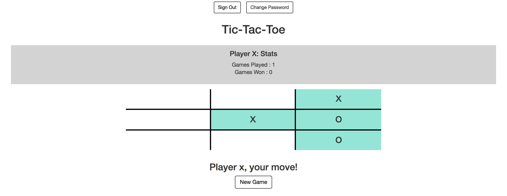
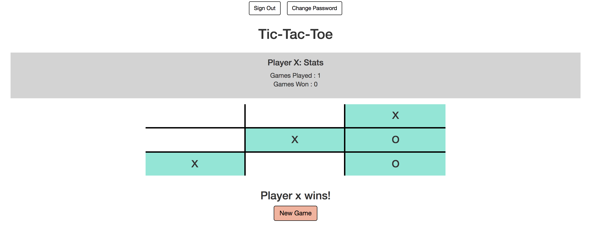

# Tic-Tac-Toe

Find the app here: [Tic-Tac-Toe](https://danielleletarte.github.io/tic-tac-toe-client/) 
Game API: [Game Project API](https://github.com/danielleletarte/game-project-api/blob/master/README.md)

## About the App
Tic-Tac-Toe is a web-based application that lets two people compete against one another. 
HTML, CSS, JavaScript and JQuery were used to build all front-end functionality. Bootstrap was leveraged to implement a mobile-first design that looks great on all devices. The provided [Game Project API](https://github.com/danielleletarte/game-project-api/blob/master/README.md) was used to store user and game state data. Data was passed to/from the backend via AJAX requests. 
One player must have an account and sign in to have access to the game. 

The player who is logged in will see her win history displayed on the playing board. At this time, the app does not support two authenticated users. 

The game board displays who has the next move and indicates when there is a winner. Select the "New Game" button for a rematch!

## Project Planning

### Approach

- My biggest asset in completing this project was a pencil and paper. I relied heavily on written flow/logic diagrams and detailed task lists to stay focused on the most ciritcal problem at any given time.
- I started by working extensively on paper before starting to code. I modeled the game logic on paper, mapping out the winning scenarios and brainstorming ways to access the array data to determine a winner. I also drew a simple data flow diagram to confirm my understanding of the API and what I would need to pass to/get from it at different points throughout a user's interaction with the app. 
- I coded the game logic and tested it locally by manipulating the "game board" object within the REPL. This allowed me to validate the game logic worked before attepting to integrate it with the API.
- Next, I cteated curl requests to validate all of the calls I knew would be required to complete the project. I used the requests to pass data to the API via the terminal and confirm my connections were in place before I began any coding to support Sign Up, Sign In, Change Password etc. on the front end.
- I started with simple forms and on the front end to validate the API requests for Sign Up, Sign In, Change Password and Sign Out. I also created a basic "game board" using HTML.
- After confirming the AJAX calls via the UI, I experimented with bootstrap to introduce a responsive design for the app that would look good on any size device. I moved from basic forms for Sign Up/Sign In to a welcome modal that pops up on page load. This ensured a user had to log in to play or have access to Change Password and Sign Out.
- Next I focused on getting the board to respond to user input. I wrote the logic to populate the squares and switch player turns and for clearing the board when the "New Game" button was selected. I then layered the game logic on top to test for a winner with each turn and log the winner to the console.
- As a next step, I worked through how to pass the results of a turn to the backend and check for a winner with each turn. Once that was resolved I worked through displaying the winner on the front end and adding additional necessary logic to reset the game board now that the API was connected.
- I then revisited the front end design to incorporate a place for player statistics. Finding a way to pull in the stats for the authenticated user, display them on the front and end have them refresh with each new game was by far the most difficult part of the project for me. I struggled with placing the PATCH and GET requests appropriately to ensure counts were accurate. I also struggled with how to iterate over the results of the GET request to parse out the games and run the win logic over each game all at once.
- After getting the stats to display accurately for Player X, I focused on getting error handing in place wherever it was necessary. I introduced front end messaging to alert users when a password is invalid, a username is taken etc. I also needed to update some of the front end behavior to accomodate error handling. For instance, the welcome modal should not close if a user inputs the wrong username/password. The error message should be displayed with the modal still accessible so the user can try inputting their credentials again.

### Wireframes and Models
  [Screen Mockups](imgs/wireframes.JPG) 
  [Game Logic](imgs/game-logic.jpeg) 
  [Data Flow](imgs/data-flow.jpeg)

### User Stories

- As a new player, I want to sign up for an account so that I can play tic tac toe.
- As a player, I want to sign in to my account so that I can play a game of tic-tac-toe.
- As a player, I want see stats like how many games I have played and how many I have won.
- As a player, I want the ability to start a new game so that I can play multiple games with my opponent.
- As a player, I want to be told if a player has won so that I don't miss my chance to claim victory!

### Stretch Goals

- (COMPLETED) Design the app to look good on all devices using response design elements.
- Support two-player authentication to track stats for both players and allow users to complete from different devices.
- Create a simple unit test that validate high level functionality to support continuous integration methodology

### Unsolved Issues
- I worked really hard to resolve all issues with completed functionality before the deadline. I believe my logic is solid and, to my knowledge, there are no bugs. I would have liked to focus more on the stretch goals but thought my time was best spent focused on making the code I had as clean as modular as I could.

- With more time I would go back and leverage Sass to clean up my styling. This was an area I wasn't able to revisit and refactor.

## [License](LICENSE)

1.  All content is licensed under a CC­BY­NC­SA 4.0 license.
1.  All software code is licensed under GNU GPLv3. For commercial use or
    alternative licensing, please contact legal@ga.co.
